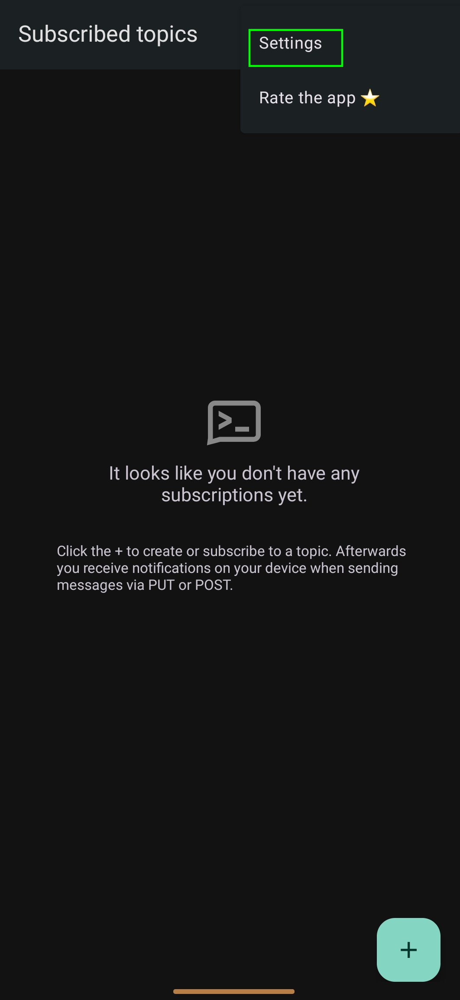
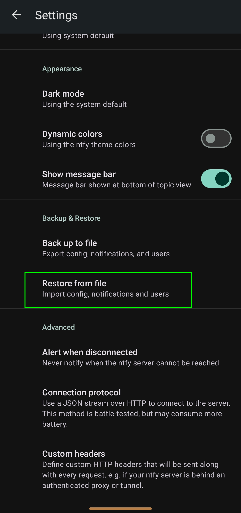
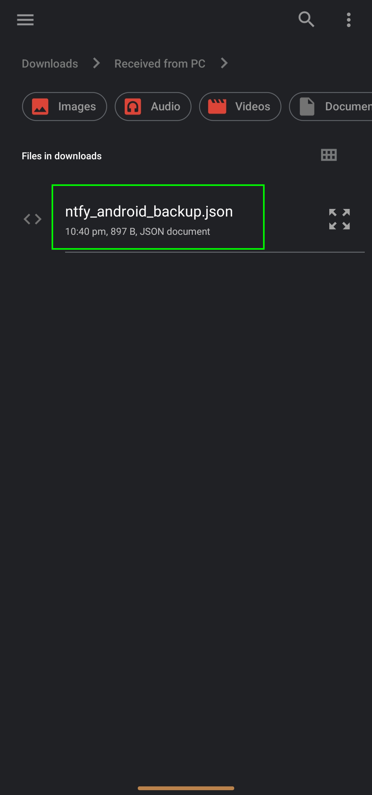
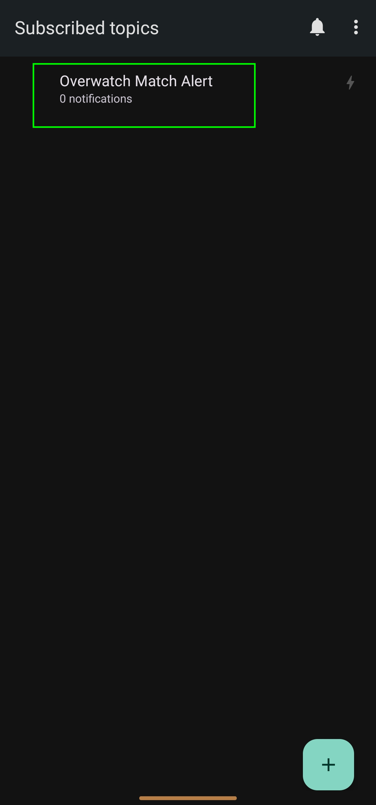
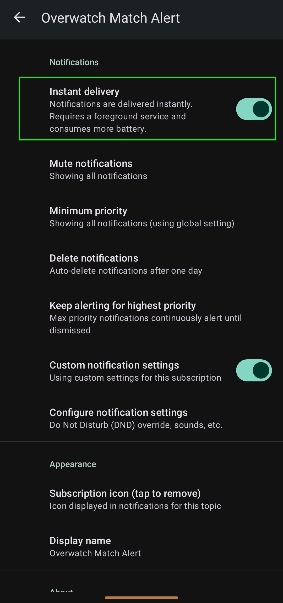

# 📖 Overwatch Match Alert — Complete User Guide & Wiki

Welcome to the official **Overwatch Match Alert** documentation! This guide covers everything you need to know about setting up, configuring, and getting the most out of every feature in the application.

---

## 📑 Table of Contents
1. [Overview & Architecture](#1-overview--architecture)
2. [Critical Display Requirement (Must Read!)](#2-critical-display-requirement-must-read)
3. [Installation & First Launch](#3-installation--first-launch)
4. [System Tray Controls & Status Indicators](#4-system-tray-controls--status-indicators)
5. [Auto-Focus & Media Auto-Pause](#5-auto-focus--media-auto-pause)
6. [Mobile Phone Alerts Setup (Android Walkthrough)](#6-mobile-phone-alerts-setup-android-walkthrough)
7. [Custom Match Detection Templates](#7-custom-match-detection-templates)
8. [Configuration (`config.ini`) & App Data Directory](#8-configuration-configini--app-data-directory)
9. [Troubleshooting & Debug Mode](#9-troubleshooting--debug-mode)

---

## 1. Overview & Architecture

**Overwatch Match Alert** is a lightweight, zero-install Windows application designed to monitor your Overwatch 2 queue in the background. Whether you're browsing the web, watching videos, working, or away from your desk getting a drink, the app alerts you immediately when your queue pops.

### Key Highlights
- **100% Anti-Cheat Safe:** The application does **not** hook into game memory, inject DLLs, or interact with game processes.
- **Hardware-Accelerated Screen Capture:** Uses the modern **Windows Graphics Capture (WGC)** API to capture video frames directly from the game's window handle, even if obscured beneath other windows.
- **Computer Vision Matching:** Analyzes frames using **OpenCV Masked Template Matching** against pixel-perfect reference images of "GAME FOUND", Hero Selection banners, and Map Loading screens.
- **Ultra-Low Resource Usage:** Captures at a low frame rate during searching and goes completely dormant once a match is found to ensure zero impact on your framerate or system performance.

---

## 2. Critical Display Requirement (Must Read!)

> [!CAUTION]
> **DO NOT minimize Overwatch 2 to the Windows Taskbar!**

### Why?
Windows Desktop Window Manager (DWM) automatically freezes rendering for hardware-accelerated DirectX games the moment they are minimized to the taskbar. When minimized, the game engine stops drawing new frames, meaning our screen scanner will only see a frozen, outdated image.

### Correct Background Queuing Workflow:
1. Open Overwatch 2 and navigate to **Options → Video → Display Mode**.
2. Set Display Mode to **Borderless Windowed** (recommended) or **Windowed**.
3. When you start searching for a match, simply **Alt-Tab**, click on your web browser, or open any other program over the game.
4. As long as the Overwatch 2 window is *open in the background* (not minimized to the taskbar icon), the scanner captures and detects matches with 100% accuracy.

---

## 3. Installation & First Launch

The application is completely portable and requires no installation or Python runtime.

1. Download **`Overwatch_Match_Alert.exe`** from the [Releases](https://github.com/XRaoulX/Overwatch-Match-Alert/releases) page.
2. Place the `.exe` in any folder of your choice (e.g., `Desktop`, `Documents`, or `C:\Tools\`).
3. Double-click the `.exe` to start.
4. The application will start silently and minimize to your **Windows System Tray** (in the bottom-right corner of your taskbar, near the system clock).

---

## 4. System Tray Controls & Status Indicators

Right-click the tray icon to access the full menu.

### System Tray Status Icons
| Icon | Status | Meaning |
| :---: | :--- | :--- |
| 🟠 | **Scanning** | Actively scanning Overwatch 2 in the background for a match. |
| 🟢 | **Match Found!** | Match detected! Alerts triggered and scanner is paused to save CPU/GPU. |
| ⚪ | **Paused** | Scanning is manually turned off. |

### Tray Menu Breakdown
- **Scanning (Checkbox):** Click to toggle the scanner on or off manually.
- **Auto-focus game (Alt-Tab) (Checkbox):** Automatically brings Overwatch 2 to the front when a match pops.
  - **Pause Media when auto-focusing (Checkbox):** Sub-toggle that pauses background music/video before alt-tabbing.
- **Select Target Window:** Lets you manually select which Overwatch window handle to capture if multiple instances exist.
- **Matches found / Scans:** Live statistics counter for the current session.
- **Test Notification (Desktop):** Plays the alert sound and fires a Windows toast notification to verify local alerts.
- **Phone Alerts (ntfy.sh) (Checkbox):** Enables/disables push notifications to your mobile phone.
- **Copy Topic: `ow_alert_xxxxxxxx`:** Copies your unique push notification channel topic to your clipboard.
- **Test Phone Alert:** Sends an instant test push alert to your phone (works even if phone alerts are currently unchecked).
- **Generate Android Backup...:** Generates a pre-configured backup `.json` file and opens it in Windows Explorer for 1-click mobile setup.
- **Open App Data Folder...:** Opens `C:\Users\<YourUser>\.ow_notifier\` in Windows Explorer.
- **DEBUG MODE ON (Checkbox):** Toggles verbose logging and saves the last 10 capture screenshots for troubleshooting.
- **Quit:** Fully exits the application.

---

## 5. Auto-Focus & Media Auto-Pause

### Auto-Focus Game (Alt-Tab)
When enabled, the app uses native Windows user32 APIs (`SetForegroundWindow`, `ShowWindow`) with input thread attachment to bring Overwatch 2 to the absolute front of your screen the split second a match is found.

### Media Playback Auto-Pause
If you are watching YouTube, listening to Spotify, or streaming media while waiting in a long queue, you don't want audio blasting over your team's voice chat when you get pulled into the game.

When **"Pause Media when auto-focusing"** is enabled:
1. A match is detected.
2. The app broadcasts a Windows `APPCOMMAND_MEDIA_PAUSE` signal across the system.
3. Your music or video player (Spotify, Chrome, Edge, VLC, etc.) instantly pauses playback.
4. The game window is focused smoothly.

> [!NOTE]
> Unlike standard keyboard play/pause toggles (which would accidentally *start* paused music), this feature specifically sends a dedicated **Pause** command, ensuring media is never accidentally resumed if already quiet.

---

## 6. Mobile Phone Alerts Setup (Android Walkthrough)

Phone alerts use [ntfy.sh](https://ntfy.sh), an open-source, anonymous, account-free notification service. You don't need to create an account, provide an email, or pay for any service.

### Step 1: Install the Free `ntfy` App
- **Android:** Download `ntfy` from the [Google Play Store](https://play.google.com/store/apps/details?id=io.heckel.ntfy) or [F-Droid](https://f-droid.org/en/packages/io.heckel.ntfy/).
- **iOS:** Download `ntfy` from the [Apple App Store](https://apps.apple.com/app/ntfy/id1625396347).

---

### Step 2: Method A — 1-Click Android Backup Import (Recommended)

To make configuration effortless, Overwatch Match Alert can automatically package your exact topic, persistent foreground connection, and high-priority alert settings into an importable backup file.

1. In the Overwatch Match Alert tray menu, check **"Phone Alerts (ntfy.sh)"** (or click **"Generate Android Backup..."**).
2. The app generates `ntfy_android_backup.json` inside your App Data folder and automatically highlights it in Windows Explorer.
3. Transfer `ntfy_android_backup.json` to your phone (via USB cable, Google Drive, email, Discord, or WhatsApp).

#### On Your Android Device:

1. **Open ntfy Settings:**
   Open the `ntfy` app, tap the **three dots (⋮)** in the top-right corner, and select **Settings**.

   

2. **Select Restore from file:**
   Scroll down to the **Backup & Restore** section and tap **Restore from file**.

   

3. **Choose the Backup File:**
   In your phone's file picker, navigate to where you saved the transferred file and select `ntfy_android_backup.json`.

   

4. **Verify Subscription:**
   You will now see **Overwatch Match Alert** listed on your home screen under Subscribed Topics.

   

5. **Confirm Instant Delivery:**
   Tap on the **Overwatch Match Alert** subscription, then tap the gear icon (top-right). Ensure **Instant delivery** is toggled **ON** so alerts arrive in under a second even when the phone is locked.

   

6. **Test Your Setup:**
   Right-click the PC tray icon and click **Test Phone Alert**. Your phone will immediately ring and display the custom Overwatch notification!

---

### Step 3: Method B — Manual Topic Setup (Alternative)
If you prefer not to transfer files:
1. In the PC tray menu, click **Copy Topic: `ow_alert_xxxxxxxx`**.
2. Open the `ntfy` app on your phone.
3. Tap the **+** (plus button) in the bottom-right corner.
4. Paste your unique topic name in the **Topic name** field.
5. Tap **Subscribe**.
6. Open the subscription settings and enable **Instant delivery**.

---

## 7. Custom Match Detection Templates

The application comes bundled with 20+ built-in, pixel-perfect templates covering standard queue states, map screens, hero selection screens, AFK alerts, and backfills.

However, if Blizzard updates their UI or you want to support specific custom lobby screens, you can add custom templates without modifying any code.

### How to Add Custom Templates:
1. In the tray menu, click **Open App Data Folder...** and open `config.ini`.
2. Under `[CustomTemplates]`, set `enabled = true`:
   ```ini
   [CustomTemplates]
   enabled = true
   directory = custom_templates
   ```
3. Create a folder named `custom_templates` in the same directory as `Overwatch_Match_Alert.exe`.
4. Place your template PNG images in that folder.

### Template Naming Convention:
- **Queue Search Templates:** Any file containing the word `searching` in its filename (e.g., `searching_custom.png`) is treated as a "Searching for Match" indicator.
- **Match Found Templates:** Any other file name (e.g., `my_custom_match.png`, `comp_found.png`) will immediately trigger the **Match Found!** alert when detected.

### Image Masking Rules:
- Images must be `.png` format.
- Pure black pixels (`RGB [0, 0, 0]`) are automatically treated as transparent masks. This allows matching shapes or text while ignoring animated background videos or shifting map lighting.

---

## 8. Configuration (`config.ini`) & App Data Directory

All user settings, logs, and generated files are stored in:
`C:\Users\<YourUsername>\.ow_notifier\`

You can quickly access this folder at any time by clicking **Open App Data Folder...** in the tray menu.

### Example `config.ini` Reference
```ini
[Settings]
# Automatically brings Overwatch 2 to the foreground when a match is found
auto_focus = true

# Pauses playing media (Spotify, YouTube, etc.) right before focusing the game
pause_media = true

# Saves the last 10 capture frames and enables verbose debug logs
debug_mode = false

[PhoneAlerts]
# Enables or disables mobile push notifications
enabled = true

# Your unique, private ntfy.sh channel topic (do not share publicly)
ntfy_topic = ow_alert_a1b2c3d4

[CustomTemplates]
# Set to true to load extra templates from your custom_templates folder
enabled = false
# Directory path (relative to the .exe or an absolute path)
directory = custom_templates
```

---

## 9. Troubleshooting & Debug Mode

### Issue: "The tray icon stays gray or doesn't find the game"
- Ensure Overwatch 2 is running and actively visible on your screen or in the background.
- Check the tray menu item **Select Target Window** to ensure it is targeting the `Overwatch` window.
- Make sure Overwatch 2 is in **Borderless Windowed** mode, **not** minimized to the taskbar.

### Issue: "Phone alerts aren't arriving or are delayed"
- Click **Test Phone Alert** in the tray menu to test connectivity.
- In your phone's `ntfy` app settings, verify that **Instant delivery** is toggled **ON** for the Overwatch topic.
- On Android, check that battery optimization for `ntfy` is set to **Unrestricted** so Android does not put the background connection to sleep.

### Issue: "A match popped but the app didn't alert me"
1. Right-click the tray icon and check **🐛 DEBUG MODE ON**.
2. Wait for your next queue.
3. Click **Open App Data Folder...** and open `ow_notifier.log` to view detailed template matching scores.
4. Check the `debug_screenshots/` folder to see the exact frames the scanner captured.
5. If the game UI changed, save the capture from `debug_screenshots/`, mask the background with black in any photo editor, and add it to `custom_templates/`!
